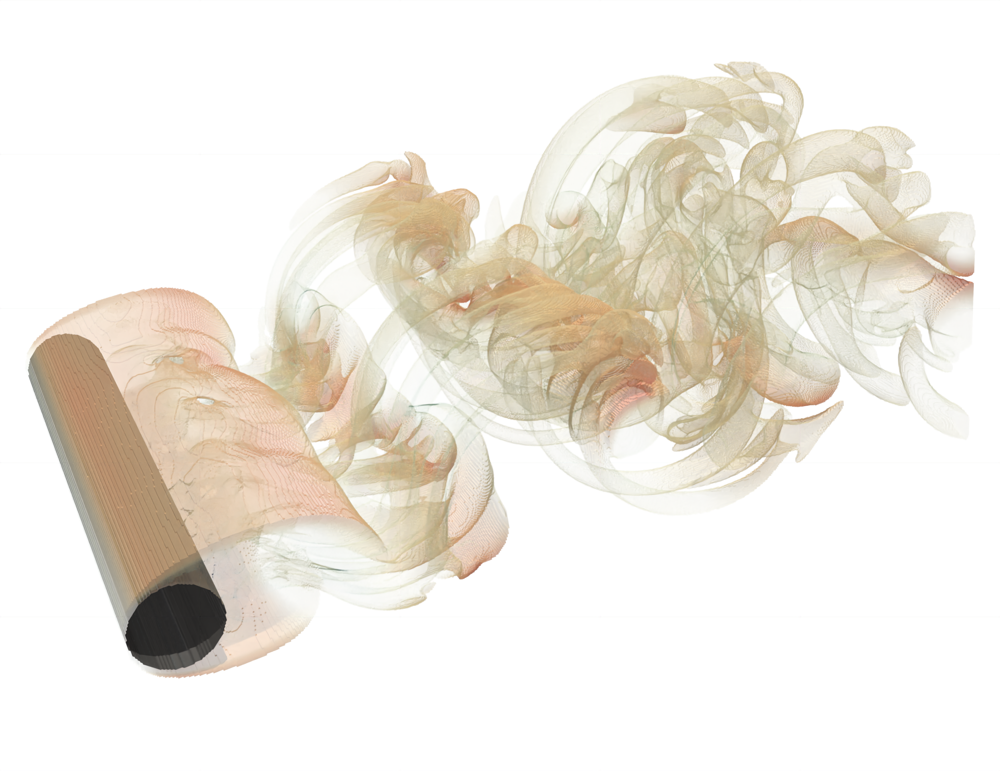
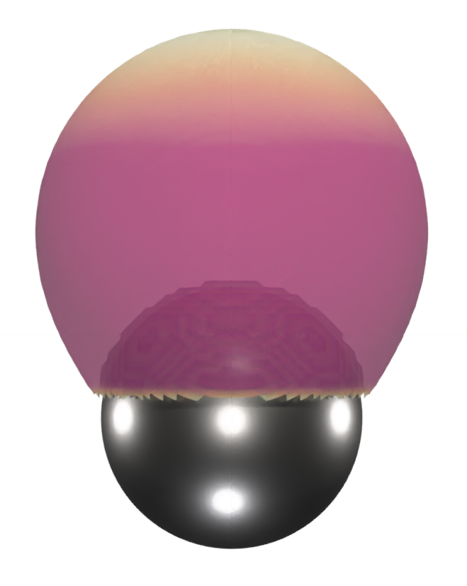
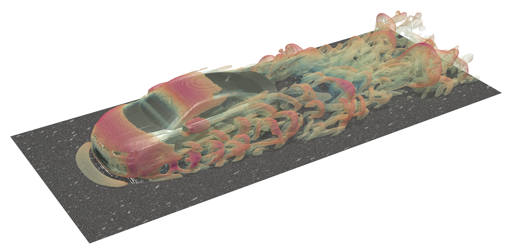

.. complexity documentation master file, created by
   sphinx-quickstart on Tue Jul  9 22:26:36 2013.
   You can adapt this file completely to your liking, but it should at least
   contain the root `toctree` directive.

========
TorchLBM
========

-------------------------------------------------------
Lattice Boltzmann Simulation Framework Based on PyTorch
-------------------------------------------------------

Features
--------

* Fully differentiable implementation of the Lattice Boltzmann method using PyTorch
* Usability features of PyTorch (Logging, Profiling, Graphical visualization of models) can be used
* Implementation based on modules allows easy integration with machine-learning modules
* Implementation degenerates to two- and one-dimensional setups
* Simulation setup offers interface to XML- and JSON-based configuration files
* Runs on GPUs. Currently, we only provide a single GPU implementation, but plan to extend it to multiple GPUs.

Installation & Development
__________________________

Installation instructions can be found :doc:`here <installation>`.
For developing inside TorchLBM or for running simulations we recommend using `Visual Studio Code`_. Some comments on setting up `Visual Studio Code`_ for TorchLBM can be found :doc:`here <development>`.

.. _`Visual Studio Code`: https://code.visualstudio.com

Documentation
-------------

The documentation of ``torchlbm`` can be build using the Makefile. Therefore, go to the folder of ``torchlbm`` and use the Makefile:

.. code-block:: bash

    cd /path/to/torchlbm
    make docs

Note, to correctly build the documentation, the development requirements of ``torchlbm`` have to be installed as explained in the installation instructions.

Example Simulations:
--------------------

Contents:
---------

.. toctree::
   :maxdepth: 2

   installation
   development
   usage
   modules
   contributing
   authors
   history

Indices and tables
------------------
* :ref:`genindex`
* :ref:`modindex`
* :ref:`search`

Feedback
--------

If you have any suggestions or questions about **TorchLBM** feel free to email me
at josef.winter@tum.de.

If you encounter any errors or problems with **TorchLBM**, please let me know!
Open an Issue at the GitHub https://gitlab.lrz.de/qcaer/torchlbm main repository.
